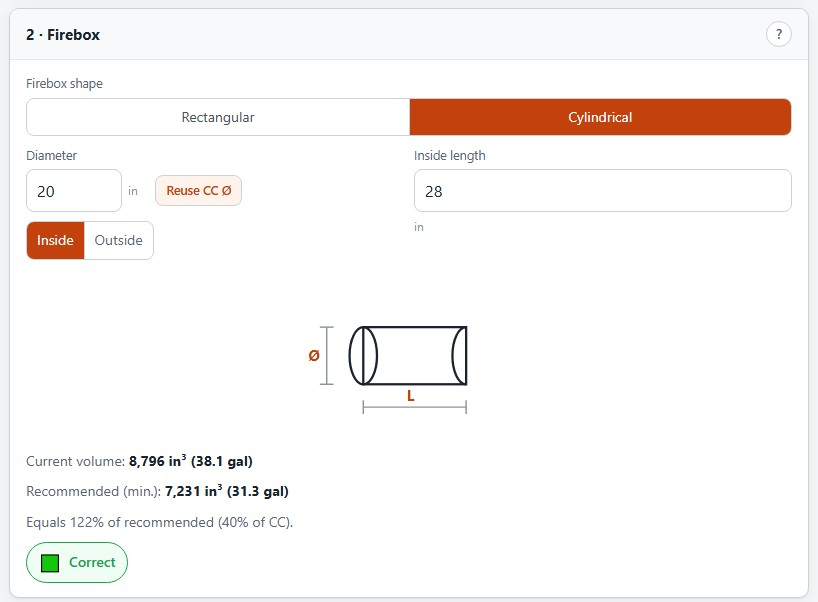
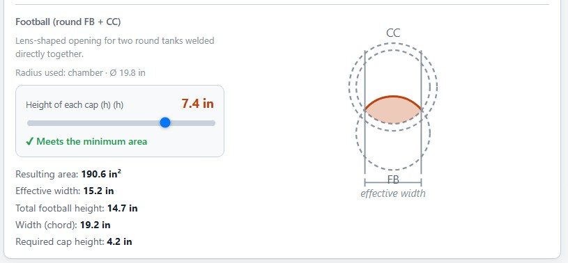

# Offset Smoker Calculator / Calculadora de Offset Smoker

<p align="center">
  <a href="https://peu.net/smoker/">🌐 Live version · Versión online</a>
</p>

<p align="center">
  <a href="#english">📖 English Readme</a> · <a href="#español">📖 Readme Español</a>
</p>

<p align="center">
  
</p>

---

<a id="english"></a>

# Offset Smoker Calculator

> Dimension calculator for **offset smokers**, based on **DaveOmak**'s formulas published at [SmokingMeatForums](https://www.smokingmeatforums.com/threads/standard-reverse-flow-smoker-calculator-by-daveomak-and-others-ready-to-use-rev5-6-19-15.172425/) (Rev5, 6/19/15).

**Languages:** Español · English (selector in-app, top right)

---

## Table of contents

- [What it does](#what-it-does)
- [How to use](#how-to-use)
- [Calculator sections](#calculator-sections)
  - [1 · Cook Chamber](#1--cook-chamber)
  - [2 · Firebox](#2--firebox)
  - [3 · FB → CC Opening](#3--fb--cc-opening)
  - [4 · Exhaust Stack](#4--exhaust-stack)
  - [5 · Air Intakes](#5--air-intakes)
  - [6 · Reverse Flow](#6--reverse-flow)
- [Formulas and constants](#formulas-and-constants)
- [Development](#development)
- [License](#license)

---

## What it does

A well-proportioned offset smoker is not guesswork: the cook chamber volume determines **all** other dimensions (firebox, openings, stack, air intakes). This calculator applies DaveOmak's empirical constants so that:

- The **firebox** has the right volume (~1/3 of the cook chamber).
- The **opening** between firebox and cook chamber passes just the right heat flow.
- The **exhaust stack** has the correct draft (ESV = CC × 0.022).
- The **air intakes** allow proper combustion control (20/80 split).
- The **reverse flow** evens out temperature across the chamber.

Everything recalculates **live** as you adjust parameters.

---

## How to use

1. Open `index.html` in a browser (or serve it with any static server).
2. Enter the **tank** dimensions you plan to use as the cook chamber (diameter and inside length).
3. Choose the **firebox shape** and its dimensions.
4. The opening is generated automatically — use the sliders to adjust **safety lip** and **side cut**.
5. Adjust the stack diameter until the recommended length is ~36″ (or whichever you prefer).
6. Set your ventilation hole diameter to know how many to drill.

> 💡 All values are auto-saved in cookies. Close and come back — you pick up where you left off.

---

## Calculator sections

### 1 · Cook Chamber

The cylinder where the food cooks. Enter the diameter in **inside** (ID) or **outside** (OD) mode. In OD mode, a wall thickness field appears so it subtracts automatically.


The chamber volume is the foundation of **all** subsequent calculations.

### 2 · Firebox

The box where the wood burns. Two shapes available:

- **Rectangular** — width × height × depth.
- **Cylindrical** — a smaller tank welded to the chamber. The "Reuse CC Ø" button preloads the same diameter as the cook chamber.

Current volume is compared against the recommended minimum (33% of CC volume) with a status indicator: 🔴 too small / 🟡 acceptable / 🟢 correct / 🟠 bigger than recommended.



### 3 · FB → CC Opening

The passage between firebox and chamber. It is calculated as **area** (not hole diameter): `CC × 0.004`.

Three construction types:

| Type | When to use |
|---|---|
| **Rectangular** | Rectangular firebox → opening matches FB width. |
| **Circular segment** | Rectangular firebox + cylindrical CC → a single cap cut on the CC wall. |
| **Football (lens)** | Cylindrical firebox + cylindrical CC → two caps forming a lens. |

 


#### Safety lip

Slider that defines an **uncut rim** between the CC outer diameter and the effective cut limit. Prevents grease and liquids from dripping into the firebox.

#### Side cut (per side)

Slider that **trims** both lateral extremes of the opening. Useful when **seams, braces or weld beads** prevent cutting all the way to the tank edge. The area calculation adjusts automatically (numerical integration with 200 strips, <0.1% error vs. the exact formula without cut).

- For **circular segments**: trims both sides of the cap.
- For **football**: trims the pointed ends of the lens.

Both sliders sit side by side for quick adjustment.

### 4 · Exhaust Stack

Draft is defined by **internal volume** (ESV = CC × 0.022). The calculator shows the required length for your chosen diameter and suggests an alternative diameter for ~36″ length.

### 5 · Air Intakes

Minimum total ventilation area is `CC × 0.001`, recommended 20% upper and 80% lower. Enter your hole diameter and the calculator tells you how many to drill.

### 6 · Reverse Flow

A baffle plate that sends heat under the grate and back over the top. The area under the plate and the end gap must **equal** the FB→CC opening (`CC × 0.004`). Toggle "Reverse Flow" on the top bar.

---

## Formulas and constants

| Constant | Value | Equation |
|---|---|---|
| CC Volume | — | π·R²·L |
| Minimum firebox | 33% of CC | CC × 0.33 |
| FB→CC opening | — | CC × 0.004 |
| ESV (stack) | — | CC × 0.022 |
| Air intakes | — | CC × 0.001 |
| Under-plate area (RF) | = opening | CC × 0.004 |
| End gap (RF) | = opening | CC × 0.004 |

### Circular segment

Area of a circle cap:

```
A = R² · acos((R − h) / R) − (R − h) · √(2 · R · h − h²)
```

### Football (lens)

Two mirrored caps of the same radius. Each cap supplies half the target area; total football height is `2 · h`.

### Side cut

When side cut is active, there is no closed-form formula for the trimmed area (the intersection of circle × segment × lateral cut has no elementary antiderivative). **Numerical integration** via Riemann sums with 200 subdivisions achieves better than 0.1% accuracy.

---

## Development

```bash
git clone https://github.com/pablopeu/smoker.git
cd smoker
npm install
npm run dev       # dev server at localhost:5173
npm test          # unit tests (Node — jsdom)
npm run build     # production build to dist/
```

### Stack

- **Vanilla JS** (no framework).
- **Vite** for bundling and dev server.
- **jsdom** for DOM integration tests.
- Inline SVG for diagrams (no external libraries).

### Tests

32 unit tests covering formulas, diagrams, persistence, and boot:

```bash
npm test
```

---

## License

Non-commercial project. Based on the work of **DaveOmak** and other contributors at SmokingMeatForums.
Original calculator by [Alien BBQ](https://www.alienbbq.com). Circle segment: [1728 Software Systems](https://1728.org/circsect.htm). Contributions: Ribwizzard.

---

<p align="center"><a href="#english">⬆ Back to top</a> · <a href="#español">📖 Readme Español</a></p>

---

<a id="español"></a>

---

# Calculadora de Offset Smoker

> Calculadora de dimensiones para **offset smoker** (ahumadero de tiro lateral), basada en las fórmulas de **DaveOmak** publicadas en [SmokingMeatForums](https://www.smokingmeatforums.com/threads/standard-reverse-flow-smoker-calculator-by-daveomak-and-others-ready-to-use-rev5-6-19-15.172425/) (Rev5, 6/19/15).

**Idiomas:** Español · English (selector en la app, arriba a la derecha)

---

## Tabla de contenidos

- [Qué hace](#qué-hace)
- [Cómo usar](#cómo-usar)
- [Secciones de la calculadora](#secciones-de-la-calculadora)
  - [1 · Cámara de cocción](#1--cámara-de-cocción)
  - [2 · Firebox](#2--firebox)
  - [3 · Apertura FB → CC](#3--apertura-fb--cc)
  - [4 · Chimenea](#4--chimenea)
  - [5 · Entradas de aire](#5--entradas-de-aire)
  - [6 · Reverse Flow](#6--reverse-flow)
- [Fórmulas y constantes](#fórmulas-y-constantes)
- [Desarrollo](#desarrollo)
- [Licencia](#licencia)

---

## Qué hace

Un **offset smoker** bien proporcionado no se adivina: el volumen de la cámara de cocción define **todas** las demás dimensiones (firebox, aperturas, chimenea, entradas de aire). Esta calculadora aplica las constantes empíricas de DaveOmak para que:

- El **firebox** tenga el volumen adecuado (~1/3 de la cámara de cocción).
- La **apertura** entre firebox y cámara de cocción pase el caudal de calor justo.
- La **chimenea** tenga el tiraje correcto (ESV = CC × 0.022).
- Las **entradas de aire** permitan regular la combustión (20/80).
- El **reverse flow** mantenga la temperatura pareja en toda la cámara.

Todo se recalcula **en vivo** mientras ajustás los parámetros.

---

## Cómo usar

1. Abrí `index.html` en un navegador (o servilo con cualquier static server).
2. Completá las dimensiones del **tanque** que vas a usar como cámara de cocción (diámetro y largo interno).
3. Elegí la **forma del firebox** y sus dimensiones.
4. La apertura se genera automáticamente — usá los sliders para ajustar el **labio de seguridad** y el **corte lateral**.
5. Ajustá el diámetro de la chimenea hasta que el largo recomendado dé ~36″ (o el que prefieras).
6. Definí el diámetro de los agujeros de ventilación para saber cuántos hacer.

> 💡 Todos los valores se guardan automáticamente en cookies. Si cerrás y volvés, retomás donde dejaste.

---

## Secciones de la calculadora

### 1 · Cámara de cocción

El cilindro donde se cocina. Podés ingresar el diámetro en modo **interno** (ID) o **externo** (OD). En modo externo aparece un campo de espesor de pared para descontar automáticamente.


El volumen de la cámara es la base de **todos** los cálculos siguientes.

### 2 · Firebox

La caja donde arde la leña. Dos formas disponibles:

- **Rectangular** — ancho × alto × profundidad.
- **Cilíndrico** — un tanque más chico soldado a la cámara. El botón "Reusar Ø cámara" precarga el mismo diámetro de la CC.

El volumen actual se compara contra el mínimo recomendado (33% del volumen de la CC) y se muestra un indicador de estado: 🔴 muy pequeña / 🟡 aceptable / 🟢 correcta / 🟠 más grande de lo recomendado.


### 3 · Apertura FB → CC

La comunicación entre el firebox y la cámara. Se calcula como **área** (no como diámetro de agujero): `CC × 0.004`.

Tres formas de construirla:

| Tipo | Cuándo se usa |
|---|---|
| **Rectangular** | Firebox rectangular → apertura rectangular del ancho del FB. |
| **Segmento circular** | Firebox rectangular + CC cilíndrica → un casquete cortado en la pared de la CC. |
| **Football (lente)** | Firebox cilíndrico + CC cilíndrica → dos casquetes que forman una lente. |

 


#### Labio de seguridad

Slider que define un **reborde** que queda sin cortar entre el diámetro exterior de la CC y el límite efectivo de corte. Sirve para frenar grasas y líquidos que puedan escurrir hacia el firebox.

#### Corte lateral (por lado)

Slider que **recorta** los extremos laterales de la apertura. Útil cuando hay **costuras, refuerzos o cordones de soldadura** que impiden cortar hasta el borde del tanque. El cálculo de área se ajusta automáticamente (integración numérica con 200 tiras, <0.1% de error respecto a la fórmula exacta sin corte).

- En el **segmento circular**: recorta ambos lados del casquete.
- En el **football**: recorta los extremos puntiagudos de la lente.

Ambos sliders están siempre lado a lado para ajuste rápido.

### 4 · Chimenea

El tiraje se define por el **volumen interno** (ESV = CC × 0.022). La calculadora muestra el largo necesario para el diámetro que ingresaste, y sugiere un diámetro alternativo para ~36″ de largo.

### 5 · Entradas de aire

El área mínima total de ventilación es `CC × 0.001`, recomendando 20% arriba y 80% abajo. Ingresá el diámetro de cada agujero y la calculadora dice cuántos hacer.

### 6 · Reverse Flow

Una placa deflectora que lleva el calor por debajo de la parrilla y lo hace volver por arriba. El área bajo la placa y la separación al final deben ser **iguales** a la apertura FB→CC (`CC × 0.004`). Se activa con el toggle "Reverse Flow" en la barra superior.

---

## Fórmulas y constantes

| Constante | Valor | Ecuación |
|---|---|---|
| Volumen CC | — | π·R²·L |
| Firebox mínimo | 33% de CC | CC × 0.33 |
| Apertura FB→CC | — | CC × 0.004 |
| ESV (chimenea) | — | CC × 0.022 |
| Entradas de aire | — | CC × 0.001 |
| Área bajo placa (RF) | = apertura | CC × 0.004 |
| Separación final (RF) | = apertura | CC × 0.004 |

### Segmento circular

Área del casquete de un círculo:

```
A = R² · acos((R − h) / R) − (R − h) · √(2 · R · h − h²)
```

### Football (lente)

Dos casquetes espejados del mismo radio. Cada casquete aporta la mitad del área objetivo, y la altura total del football es `2 · h`.

### Corte lateral

Cuando hay corte lateral activo, no existe fórmula cerrada para el área recortada (la intersección círculo × segmento × recorte lateral no tiene antiderivada elemental). Se usa **integración numérica** por sumas de Riemann con 200 subdivisiones, que da precisión mejor que 0.1%.

---

## Desarrollo

```bash
git clone https://github.com/pablopeu/smoker.git
cd smoker
npm install
npm run dev       # servidor de desarrollo en localhost:5173
npm test          # tests unitarios (Node — jsdom)
npm run build     # build de producción en dist/
```

### Stack

- **Vanilla JS** (sin framework).
- **Vite** para bundling y dev server.
- **jsdom** para tests de integración con el DOM.
- SVG inline para los diagramas (sin librerías externas).

### Tests

32 tests unitarios que cubren fórmulas, diagramas, persistencia y boot:

```bash
npm test
```

---

## Licencia

Proyecto sin fines comerciales. Basado en el trabajo de **DaveOmak** y otros contribuyentes de SmokingMeatForums.
Calculadora original de [Alien BBQ](https://www.alienbbq.com). Segmento circular: [1728 Software Systems](https://1728.org/circsect.htm). Contribuciones: Ribwizzard.

---

<p align="center"><a href="#español">⬆ Volver arriba</a> · <a href="#english">📖 English Readme</a></p>
